# Lab 1: Exploiting an API Endpoint Using Documentation

* **Vulnerability Type:** Exposed API Documentation / Broken Object Level Authorization (BOLA)
* **Platform:** PortSwigger Web Security Academy

---

##  Introduction to API Testing

Before jumping into the labs, let's understand what an **API (Application Programming Interface)** is. 
* Imagine an API like a **digital waiter**. Instead of serving food in a restaurant or hotel, it acts as a waiter for the web, passing requests back and forth between users and servers. 
* It enables software systems and applications to communicate and share data. 

**API Testing** checks whether application programming interfaces (APIs) are performing their expected functionality correctly. This involves inspecting these communication channels to protect the three core pillars of cybersecurity—the **CIA Triad** (Confidentiality, Integrity, and Availability).

The process starts with **reconnaissance**—gathering as much information about the API as possible—and searching for **API documentation** (similar to an employee handbook), which developers sometimes leave behind. Security testers use this documentation to discover hidden functionalities and map out potential vulnerabilities.

Modern web applications rely heavily on APIs to communicate, share data, and power dynamic front-ends. Because vulnerabilities in these interfaces can severely impact confidentiality, integrity, and availability, API testing is a critical security skill.

In this lab, we explore RESTful/JSON APIs, hidden endpoints not fully utilized by the front-end, and server-side parameter handling.

* **Lab Name:** Exploiting an API endpoint using documentation
* **Objective:** Discover hidden API documentation to identify and execute an administrative `DELETE` function against the user `carlos`.

---

##  Environment Setup & Troubleshooting

When launching the lab inside Kali Linux, the built-in Burp browser kept loading indefinitely due to a compatibility issue with the host system's browser sandbox. 

* **The Fix:** Launching Burp Suite from the terminal using the `--no-sandbox` flag fixed the hanging issue and allowed normal page loading and traffic interception.

By using Burp Suite's built-in browser, log in to your PortSwigger account and browse the [PortSwigger API Testing Labs page](https://portswigger.net/web-security/api-testing).

---

##  Step-by-Step Walkthrough

1. Go to Burp's browser and click the **Access the lab** button.
   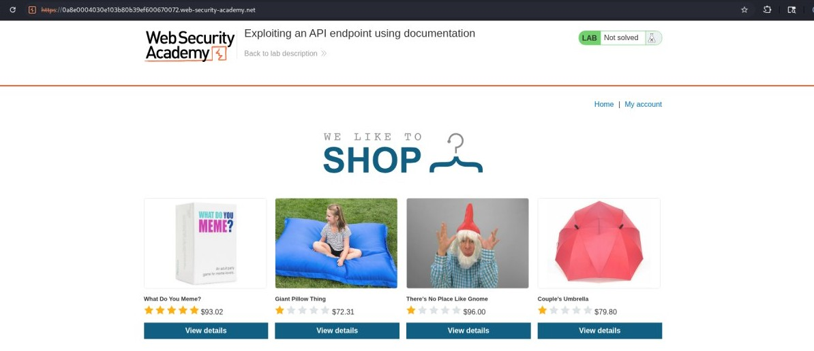

2. Log in to the application using the default credentials `wiener:peter`.
   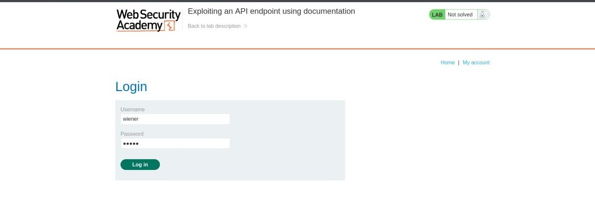

3. Update your account email address to `testapi@gmail.com`.
   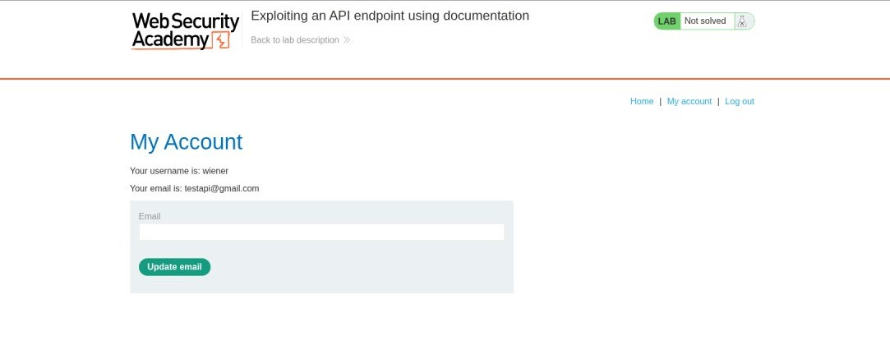

4. In Burp, go to the **Proxy > HTTP history** tab, right-click the `PATCH /api/user/wiener` request, and select **Send to Repeater**.
   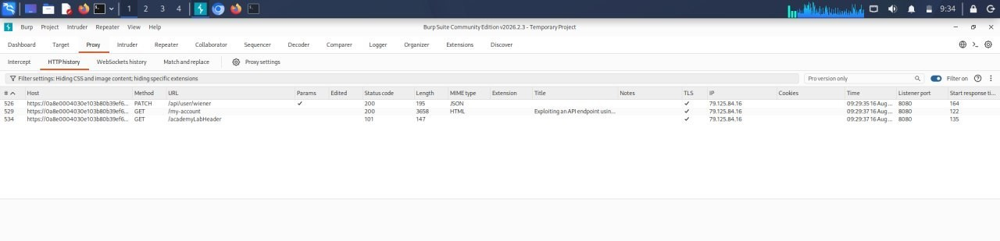

5. Go to the **Repeater** tab and send the `PATCH /api/user/wiener` request. Notice that this retrieves credentials for the user `wiener`.
   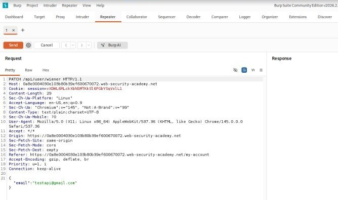

6. Remove `/wiener` from the path of the request so the endpoint is now `/api/user`, then send the request. Notice that this returns an error because there is no user identifier.
   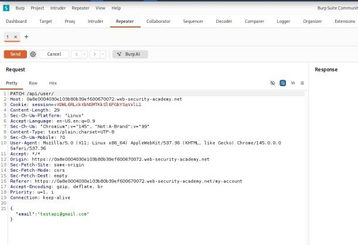

7. Remove `/user` from the path of the request so the endpoint is now `/api`, then send the request. Notice that this retrieves the API documentation.
   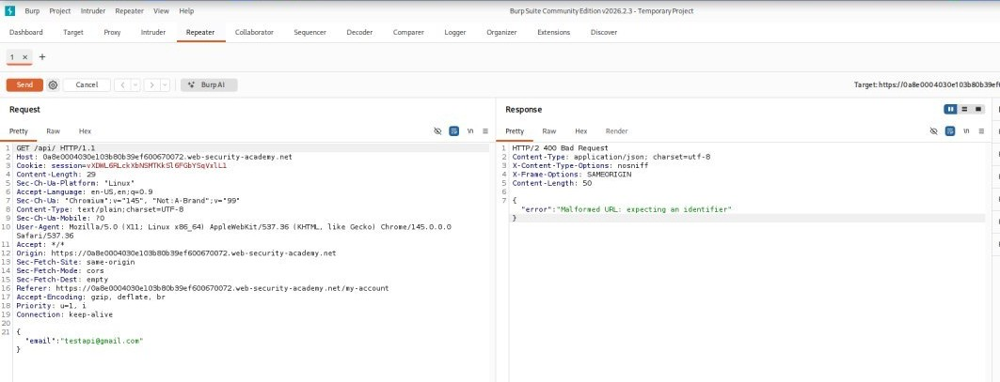

8. Right-click the response and select **Show response in browser**. Copy the generated URL.
   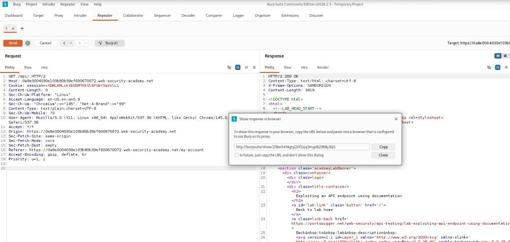

9. Paste the URL into Burp's browser to access the documentation. Notice that the documentation is interactive.
   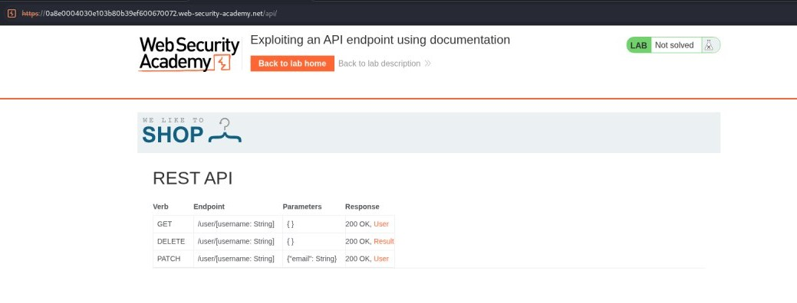

10. Click on the **DELETE** row.
    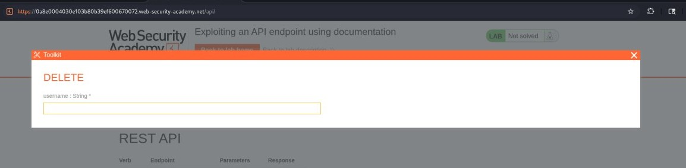

11. Enter `carlos` as the target parameter.
    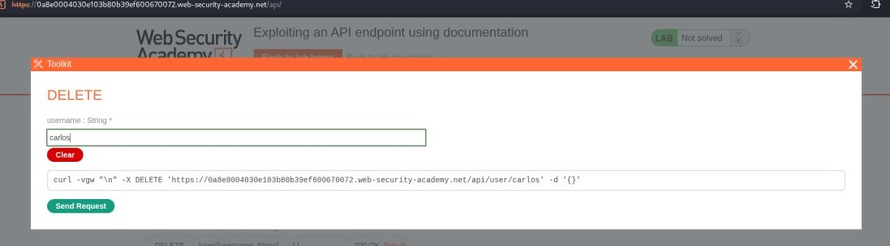

12. Click **Send request** to execute the deletion and complete the lab successfully!
    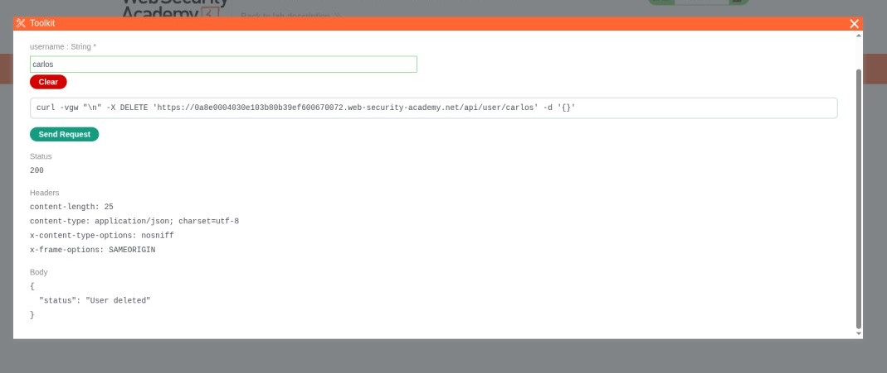

---
