# Lab 2: Finding and Exploiting an Unused API Endpoint

- **Goal:** Exploit a hidden API endpoint to change the price of the **Lightweight "l33t" Leather Jacket** to $0.00, add it to your basket, and place the order.
- **Provided Credentials:** `wiener:peter`

---

## Setup 

When launching the lab inside Kali Linux, the built-in Burp browser kept loading indefinitely due to a compatibility issue with the host system's browser sandbox. 

* **The Fix:** Launching Burp Suite from the terminal using the `--no-sandbox` flag fixed the hanging issue and allowed normal page loading and traffic interception.

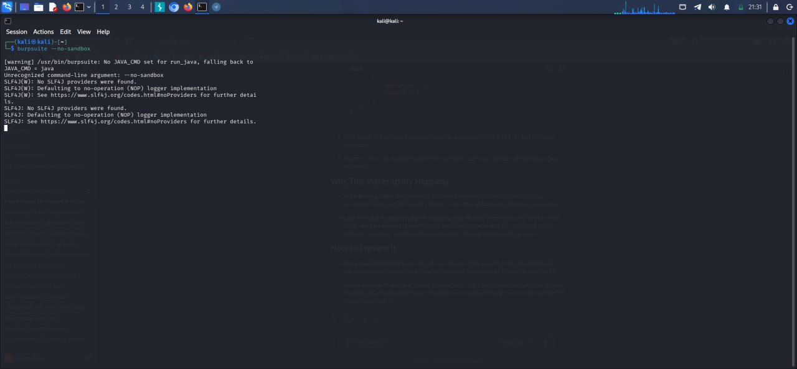

By using Burp Suite's built-in browser, log in to your PortSwigger account and browse the [PortSwigger API Testing Labs page](https://portswigger.net/web-security/api-testing).

---

## Step-by-Step Walkthrough

1. Go to Burp's browser and click the **Access the lab** button.   
   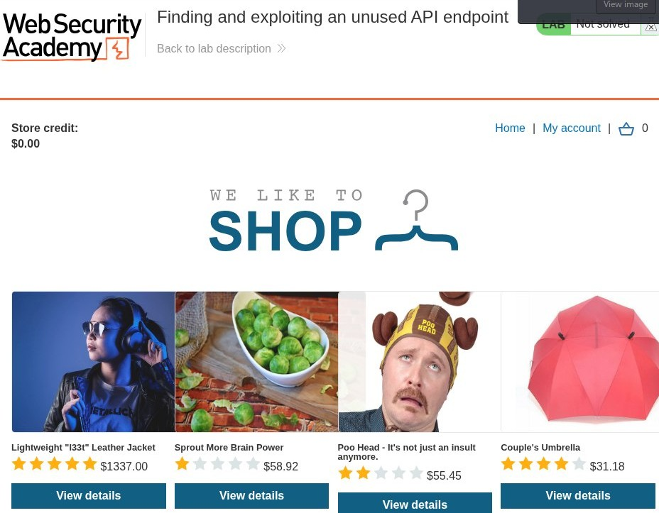
   and log in using the provided credentials: `wiener:peter`.
 
then Open Burp Suite, ensure Intercept is on, and browse to any product page (such as the Lightweight "l33t" Leather Jacket).
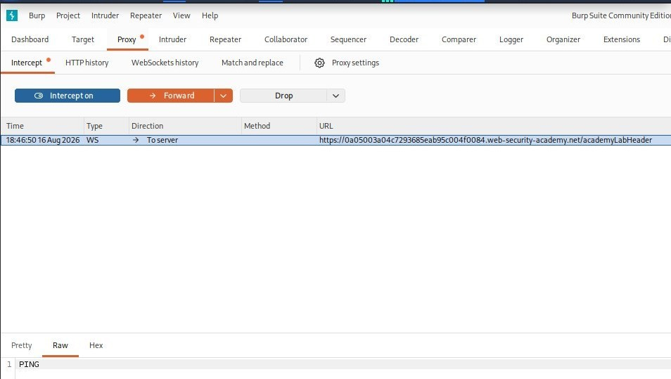
2. Click on the product page.
   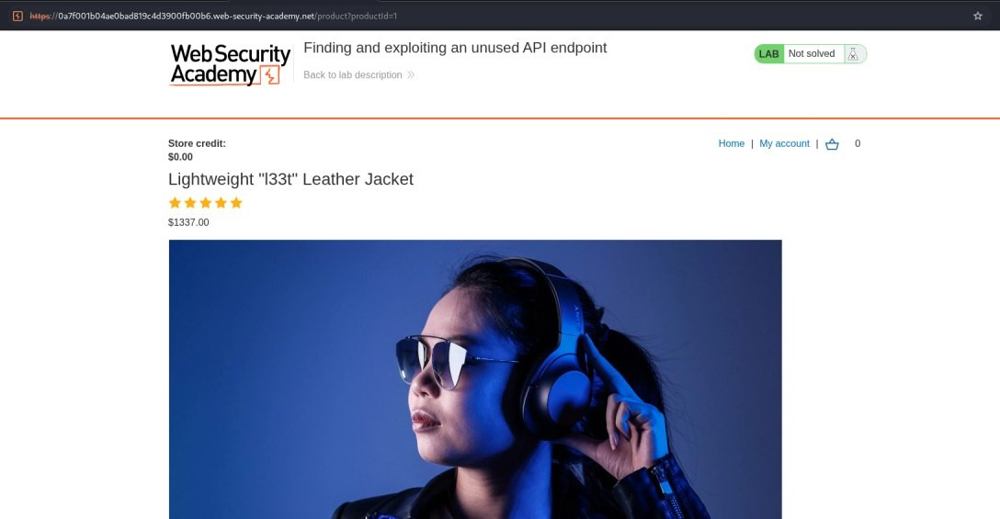

3. In Burp, go to the **Proxy > HTTP history** tab and locate the `/api/products/1/price` request.
   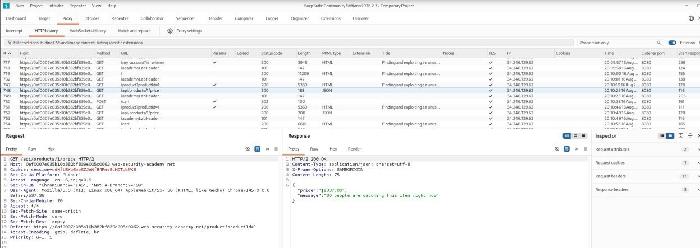

4. Right-click the API request and select **Send to Repeater**.
   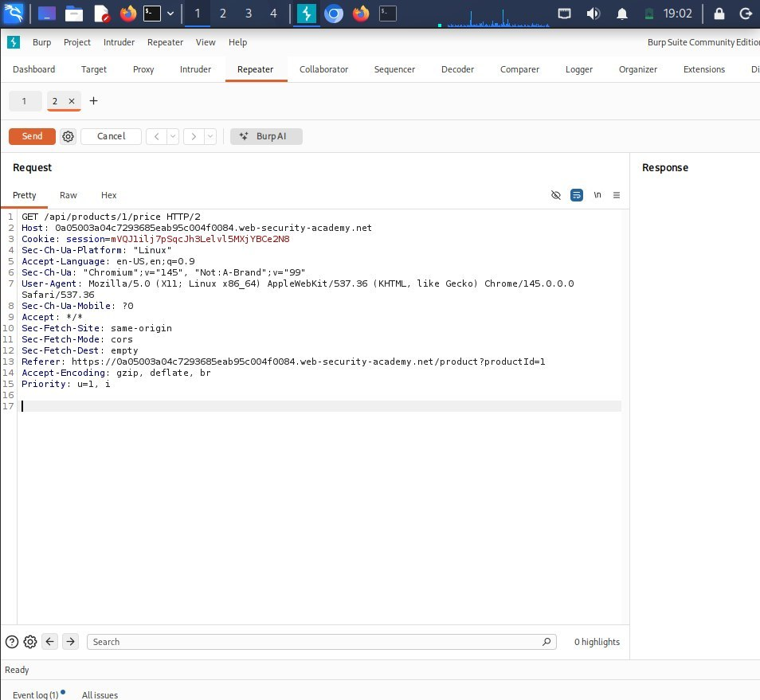

5. Go to the **Repeater** tab and change the HTTP method from `GET` to `OPTIONS`, then send the request. you can see the response specifies which methods are allowed.
   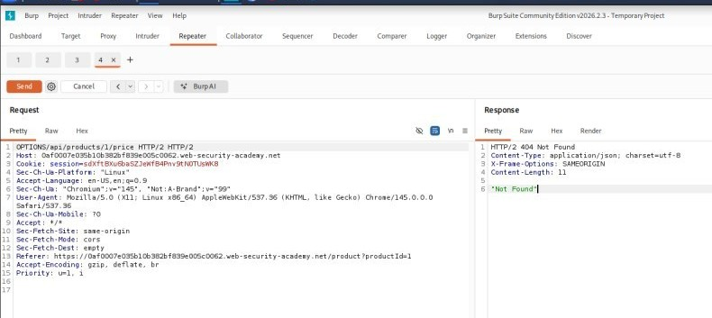
   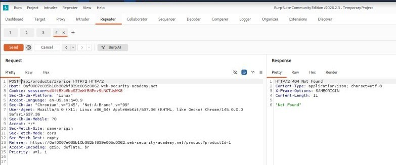

6. Change the method from `GET` to `PATCH`, then send the request. Notice that you receive an unauthorized message, indicating you need to be authenticated.
   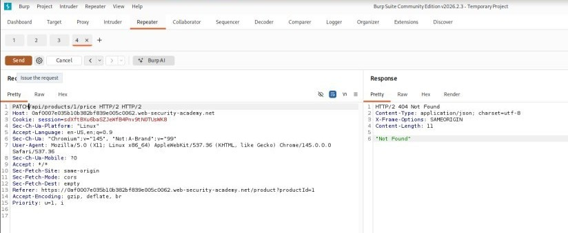

7. when receive an Unauthorized response,  copy authentication details from your logged-in browser session into the Repeater request.
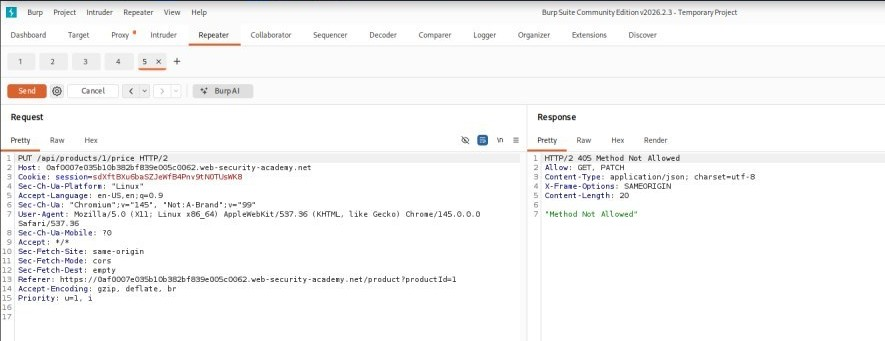
    
    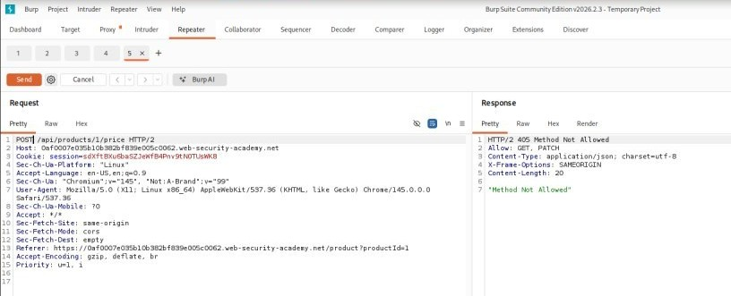

8. Send the request. Notice that this causes an error due to an incorrect `Content-Type`.

 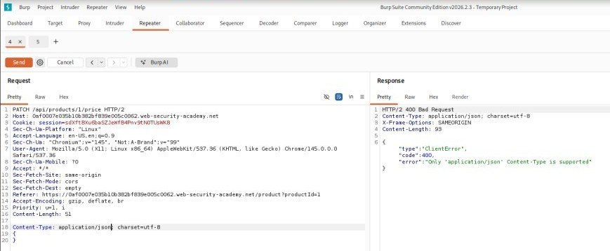

 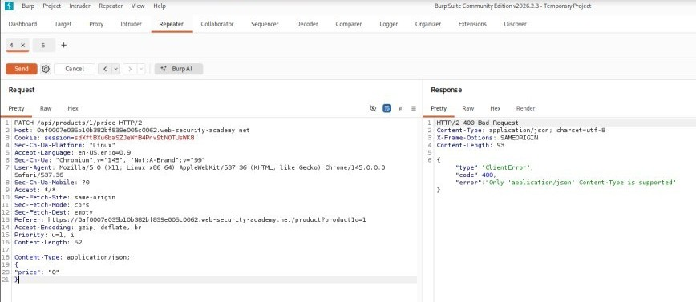

   

9. Add a `Content-Type` header and set its value to `application/json`.

 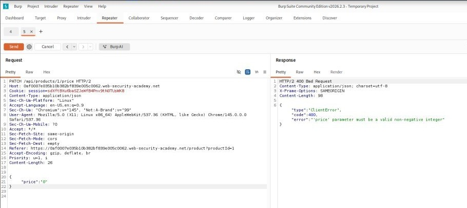

 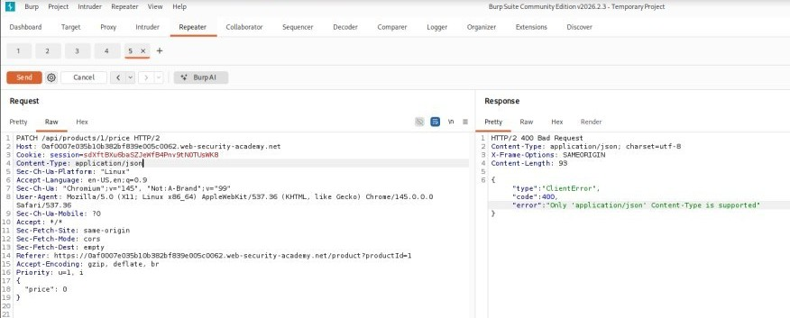

10. Add an empty JSON object `{}` as the request body, then send the request. Notice that this causes an error because the `price` parameter is missing.
    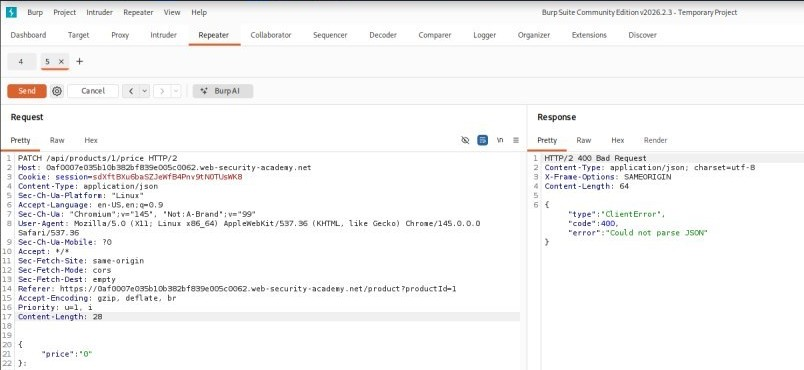

11. Add a `price` parameter with a value of `0` to the JSON object (`{"price":0}`) and send the request.
    

12. In Burp's browser, reload the leather jacket product page. Notice that the price of the leather jacket is now `$0.00`.
    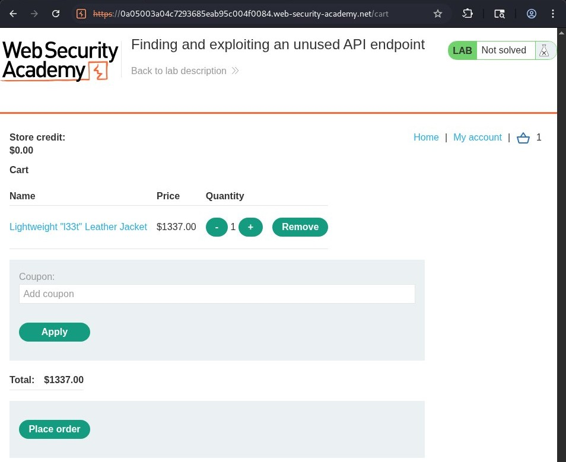

13. Add the leather jacket to your basket, go to your basket, and click **Place order** to solve the lab.
    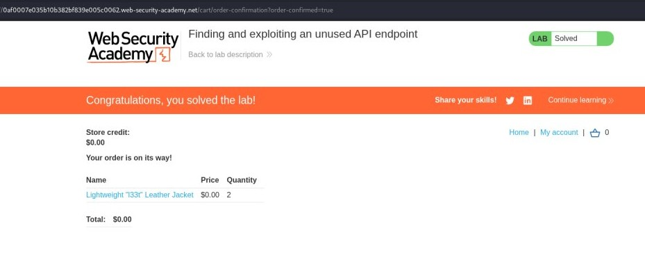

---
