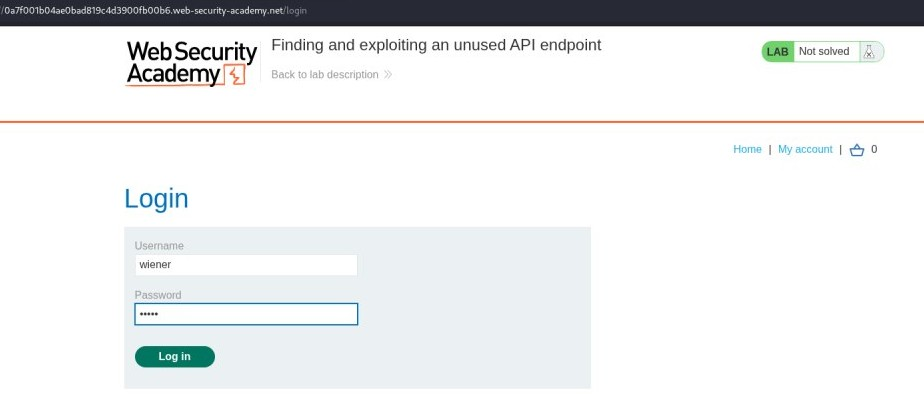
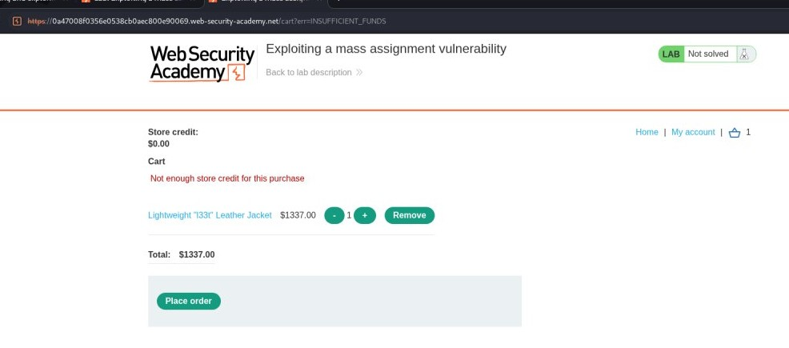
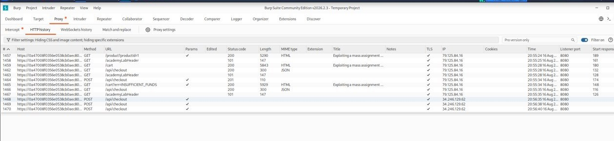
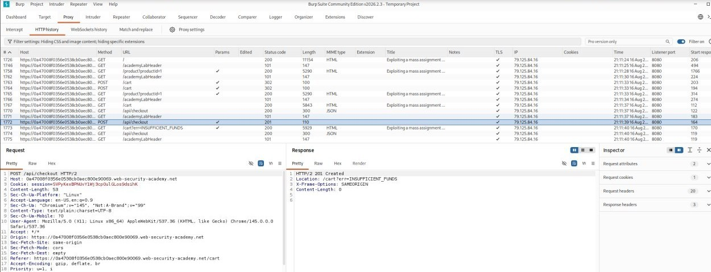
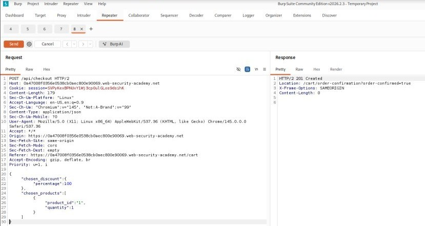
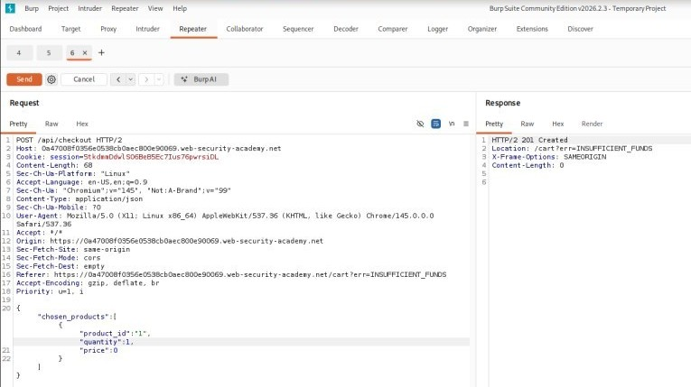
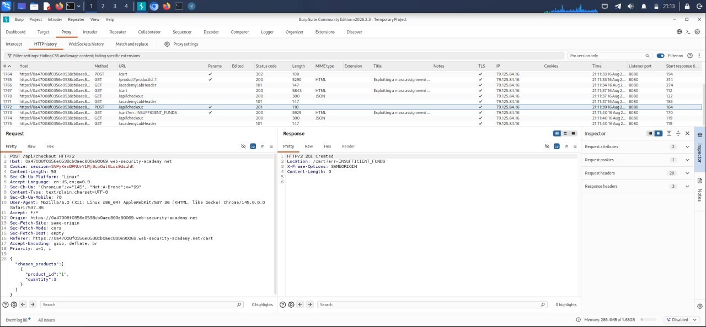
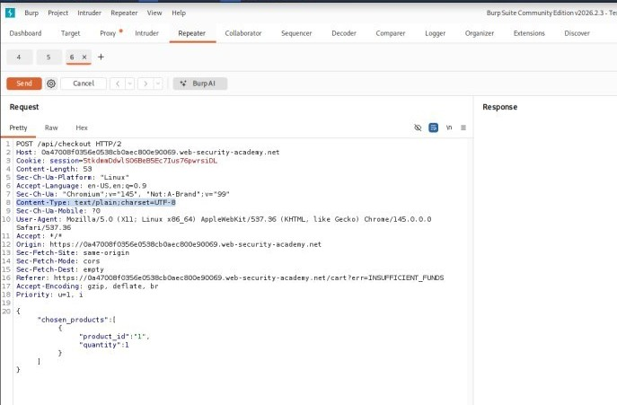

# Lab 3: Exploiting a Mass Assignment Vulnerability

---

- **Objective:** Find and exploit a mass assignment vulnerability to buy the **Lightweight "l33t" Leather Jacket** for free.

---

## Setup 

When launching the lab inside Kali Linux, the built-in Burp browser kept loading indefinitely due to a compatibility issue with the host system's browser sandbox. 

* **The Fix:** Launching Burp Suite from the terminal using the `--no-sandbox` flag fixed the hanging issue and allowed normal page loading and traffic interception.


By using Burp Suite's built-in browser, log in to your PortSwigger account and browse the [PortSwigger API Testing Labs page](https://portswigger.net/web-security/api-testing).

---

## Step-by-Step Walkthrough

1. Go to Burp's browser and click the **Access the lab** button.
   

2. Log in to the application using the default credentials `wiener:peter`.
   

3. Go to your basket and click **Place order**. Notice that you don't have enough credit for the purchase.
   

4. In Burp, go to the **Proxy > HTTP history** tab, and notice both the GET and POST API requests for `/api/checkout`.
   
   

5. Observe that the response to the GET request contains the same JSON structure as the POST request.
   
   
   
   Notice that the JSON structure in the GET response includes a `chosen_discount` parameter, which is not present in the POST request.
   

6. Right-click the `POST /api/checkout` request and select **Send to Repeater**.
   

7. In Repeater, add the `chosen_discount` parameter to the request body. The JSON should look like this:
   ```json
   {
       "chosen_discount":{
           "percentage":0
       },
       "chosen_products":[
           {
               "product_id":"1",
               "quantity":1
           }
       ]
   }
8.  Send the request. Notice that adding the chosen_discount parameter doesn't cause an error.

9. Change the chosen_discount value to the string "x", then send the request. Observe that this results in an error message as the parameter value isn't a number. This may indicate that the user input is being processed.

10. Change the chosen_discount percentage to 100, then send the request to solve the lab.