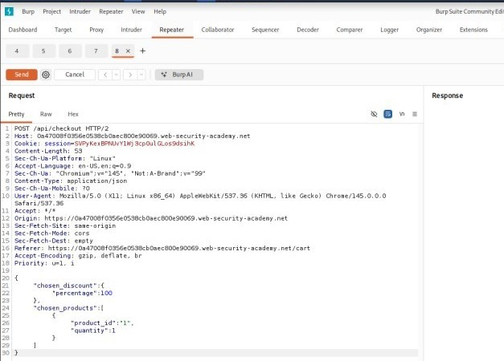
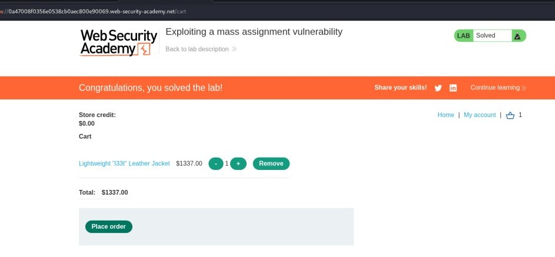

# Lab 3: Exploiting a Mass Assignment Vulnerability

---

- **Objective:** Find and exploit a mass assignment vulnerability to buy the **Lightweight "l33t" Leather Jacket** for free.

---

## Setup 

When launching the lab inside Kali Linux, the built-in Burp browser kept loading indefinitely due to a compatibility issue with the host system's browser sandbox. 

* **The Fix:** Launching Burp Suite from the terminal using the `--no-sandbox` flag fixed the hanging issue and allowed normal page loading and traffic interception.


By using Burp Suite's built-in browser, log in to your PortSwigger account and browse the [PortSwigger API Testing Labs page](https://portswigger.net/web-security/api-testing).

---

## Step-by-Step Walkthrough

1. Go to Burp's browser and click the **Access the lab** button.
   

2. Log in to the application using the default credentials `wiener:peter`.
   

3. Go to your basket and click **Place order**. Notice that you don't have enough credit for the purchase.
   

4. In Burp, go to the **Proxy > HTTP history** tab, and notice both the GET and POST API requests for `/api/checkout`.
   

5. Observe that the response to the `GET` request contains the same JSON structure as the `POST` request. Right-click the `POST /api/checkout` request in your HTTP history and select **Send to Repeater**.
   

   

6. Go to the Repeater tab.
   

7. Make sure to change the `Content-Type` header to `application/json`.
   

8. Go to the Repeater tab, update your JSON body on the left panel so it includes the `chosen_discount` object with a 100 percentage discount:
   ```json
   {
       "chosen_discount": {
           "percentage": 100
       },
       "chosen_products": [
           {
               "product_id": "1",
               "quantity": 1
           }
       ]
   }


9. then send the request to solve the lab.

